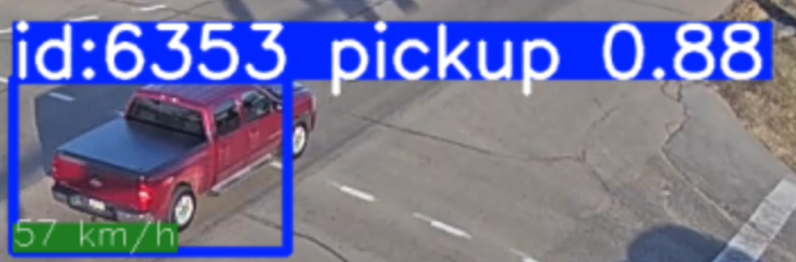
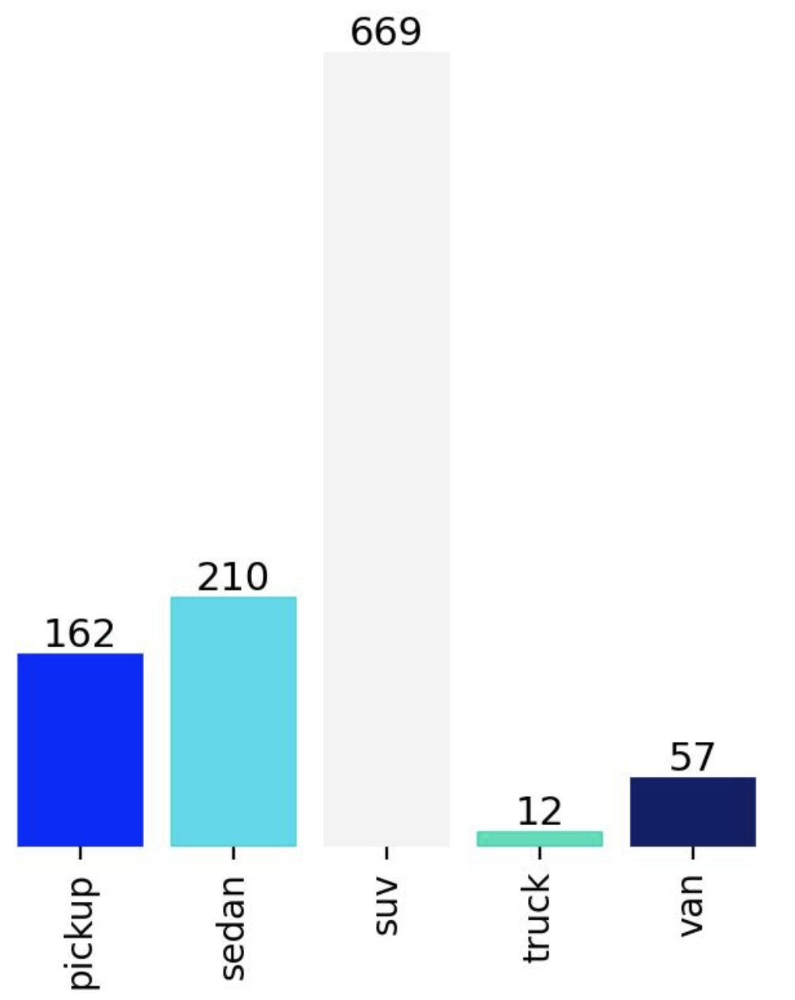

# Dominion Take Home Assessment

I chose to take on Problem 1.

## Running the program

```
uv run main.py
```

## Overview of Project

For this problem, I found a live feed of a traffic camera (located somewhere in Iowa), and tracked the cars that are visible in the feed.

For each car, my model classifies it as one of `['pickup', 'sedan', 'suv', 'truck', 'van']`. This classification is shown on the boundary box with the confidence value.
Additionally, I compute the speed for each car and also show that in the boundary box.



### YOLO Model

I chose to go with a YOLO11 model, simply because it was the recommended stable model I found after a quick search. 
Conveniently, YOLO11 has an attention mechanism, thus dealt really well with occlusion, and frame-to-frame object tracking, two problems that could've been much harder to overcome if using an older model.

### Model training

Training was relatively straightforward. I downloaded a 15-minute clip from the camera feed, and uploaded it to Roboflow.com. I then simply labelled a number of frames until my model was performing well enough.

In total, I labelled 60 frames and ended up with the following label counts:



This is of course not enough data for a production system, but was good enough for this project.

To train my model, I simply used the ultralytics yolo CLI tool:

```
yolo detect train data=data/traffic_2.v1i.yolov11/data.yaml model=yolo11s.pt epochs=60
```

### Homography

The data labelling + model training phases were tedious, but pretty straightforward. After going through those mechanical steps, I was pretty much able to fulfill Problem 1's requirements. 
I thus wanted to challenge myself a bit and compute some extra dimensions such as car speed.

There a few ways to do this. One simple way is to simply track two points in the picture, map the pixel distance to real world distance using control points, and see how many frames it takes for a car to go from point 1 to point 2.
The issue here is that you'll only get car speeds between the points that you've manually set. I wanted to get the speed for all cars throughout the picture.

The most scalable way I found to do this was to use homography to map the camera persective picture to a 2D coordinate system. Once I had that, computing speed for each car was simple: take the two positions that the car most recently reached in the 2D coordinate system, and compute the distance them. Then compute the time between those frames (`num_frames/FPS`).
This meant tracking each car in view's historical positions along with the associated frame number. This logic is implemented in the class `traffic_map.Car`.

To compute the homography matrix. I used QGIS which allowed me to set ground control points on an individual frame of the camera feed and map them to the web mercator coordinate system. I originally tried to compute the homography matrix between a camera frame and a screenshot of a 2D map segment (thus project from one pixel coordinate systme to another pixel coordinate system), but the results were not great.
Mapping to web mercator coordinate system produced decent results. 


_(Definitely not perfect but not awful)_

As you can see from the picture above, computing this projection allowed me to map the cars from the camera feed onto a 2D map in realtime. With this data, doing spatial analysis becomes much simpler.
With the color code, you can visualize when the YOLO model flip flops between labels during a car's path. I also added a histogram in the bottom right to track the label counts in view.

## Code Structure

```
- data/               # The data used to train the YOLO model. This was downloaded from Roboflow after I finished labelling the dataset
- models/             # The artifacts, including the actual weights, from training the YOLO model using the ultralytics CLI 
- videos/             # The trimmed video I used while developing. This is a clip from the actual camera feed. You can also run the program with the live camera feed directly. A longer video can be found at https://drive.google.com/uc?export=download&id=1npPgva8HNwcM_B56UqeZ7s3xKZL0vcE_
- homography.py       # The script I use to compute the homography matrix. The crucial piece is actually the manually picked Ground Control Points located in road_iowa.png.points.csv
- trafficdetection.py # This file holds the TrafficDetector class. This class mainly reads the video frame by frame and runs the YOLO model. It also calls TrafficMap to compute the 2D map.
- trafficmap.py       # Holds all logic to compute the 2D map 
```

## Demo video

loom video link: https://www.loom.com/share/6a47a207b2364e1b9d20904b730734f7

## Improvements

The main things I would do to improve my system would be to train the model with more data, and compute a more accurate homography projection. 
I intentionally decided to timebox these activities as I thought those manual tasks are not as interesting in the context of take home interview, even though they are extremely important to the accuracy of the system.
